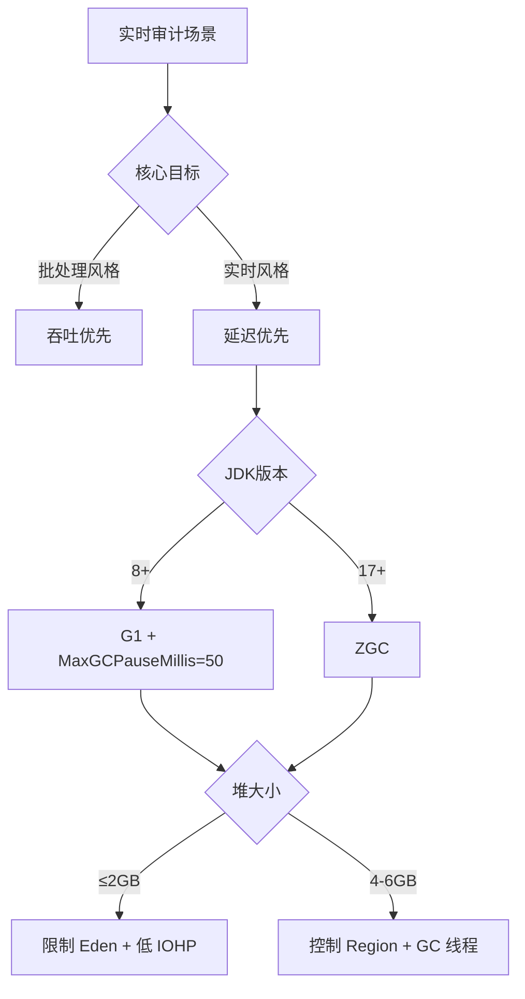

# Druid-ak 实时审计场景 — JVM 调优方向与思路

> **文档定位**：阐述 JVM 参数调优的**方向选择与决策推演**（Why/Which），不展开具体参数（见 `JVM参数调优建议.md`）和公式推导（见 `JVM调优方案-v2.md`）。
> **需求来源**：详见 `req.md` 中的 9 条需求条目（R-01~R-09）。
> **适用版本**：druid-ak-1.2.27

---

## 一、问题本质：厘清"到底在优化什么"

### 1.1 从需求反推核心矛盾

分析 req.md 的 9 条需求，可提炼出三个核心矛盾：

```
矛盾一：暂停 vs 堆大小
  GC 暂停 < 50ms     ←→   堆要够大（防 OOM）
  G1 扫堆时间 ≈ 堆大小         Old Gen 随数据量增长

矛盾二：吞吐 vs 资源
  支撑 11,600 SQL/s     ←→   内存与其他程序共享，不能多占
  提高吞吐需要更大 Eden        设备下限只有 8GB

矛盾三：通用 vs 分档
  一套参数管所有设备     ←→   OS 内存从 8GB 到 128GB
  运维简单                  资源利用率最大化
```

**调优的方向，就是在这些矛盾中找到每个档位的平衡点。**

### 1.2 业务的"不可能三角"

```
         低暂停（<50ms）
            / \
           /   \
          /     \
  高吞吐 ──────── 小内存
      （最多只有两项能同时满足）
```

- S 档（8GB）：**低暂停 + 小内存** → 牺牲吞吐（1 线程，~2,000 SQL/s）
- XL 档（128GB）：**低暂停 + 高吞吐** → 不追求小内存（6GB 堆）
- 如果既要高吞吐又要小内存 → 只能容忍高暂停（不可接受，因为实时审计）

这个三角关系决定了分档策略——**不同硬件约束选不同的边**，而不是所有场景解同一个方程。

---

## 二、总体方向：为什么是"低延迟优先"

### 2.1 方向选择树



### 2.2 选择"低延迟优先"的理由

| 备选方向 | 得分 | 为什么否掉 |
|---------|------|-----------|
| **吞吐优先**（Parallel GC / 大 Eden） | ❌ | 一次 Young GC ~150ms，实时审计卡死一个窗口；C 宿主无法容忍 |
| **内存最小化**（Xmx=1GB 固定） | ❌ | 6 节点实测 heap used 峰值 1.4GB，数据已证明 OOM 风险 |
| **自动调优**（-XX:+UseAdaptiveSizePolicy） | ❌ | G1 默认 adaptive 行为不可控，且 resize 过程有 ms 级抖动 |
| **低延迟优先**（MaxGCPauseMillis=50 + 分档） | ✅ | 暂停可控（20-40ms），吞吐影响 <3% |

### 2.3 方向验证：低延迟策略的可行性

```
假设 MaxGCPauseMillis=50，G1 会：
├── 缩小 Eden 代 → Young GC 更频繁但每次更短
├── 增加并发标记频率 → 更快回收 Old Gen
├── 更激进地选择 Mixed GC 候选 region
└── 最终效果：单次暂停从 ~80ms 降到 ~20-40ms
    代价：GC CPU 从 ~2% 升到 ~3%（可接受）
```

**关键判断**：低延迟策略的代价（+1% CPU）远小于收益（暂停减半）。在实时审计场景下，这个取舍是确定的——不需要 A/B 测试论证。

---

## 三、关键决策点的推演过程

### 3.1 GC 选型：从 4 个候选筛到 2 个

| GC | 暂停 | 堆开销 | 配置复杂度 | 可用 JDK | 结论 |
|----|------|--------|-----------|---------|------|
| Serial GC | ~100ms+ | 低 | 极简 | 8+ | ❌ 暂停不达标 |
| Parallel GC | ~150ms+ | 低 | 低 | 8+ | ❌ 暂停不达标 |
| **G1** | **~20-40ms** | 低 | 中 | **8+** | **✅ 通用选择** |
| **ZGC** | **<1ms** | ~10% | 极简 | **17+** | **✅ XL 档优先** |

**决策规则**：JDK 17+ 且 OS 内存 ≥64GB → ZGC；否则 G1。没有 Parallel/Serial 的选项——实时场景对暂停有硬约束。

### 3.2 MaxGCPauseMillis：为什么是 50 不是 100 也不是 10

| 候选值 | 预期暂停范围 | 吞吐影响 | 是否满足 R-01 |
|--------|------------|---------|-------------|
| 10 ms | 5-10ms | 大（GC 过于频繁） | ❌ 吞吐不可接受 |
| **50 ms** | **20-40ms** | **小（~3%）** | **✅** |
| 100 ms | 50-80ms | 极小 | ❌ P99 超 50ms 约束 |
| 200 ms（默认） | 60-120ms | 极低 | ❌ |

**选择逻辑**：50ms 是 G1 在"暂停够短"和"吞吐可接受"之间的拐点。往下到 10ms，G1 会为满足目标过度缩小 Eden，导致 Young GC 过于频繁；往上到 100ms，P99 可能突破 50ms 的需求上限。

### 3.3 堆大小策略："固定堆"为什么必须

这是 C 调用 JAR 场景特有的约束，独立 Java 应用不一定需要。

| 策略 | 效果 | 适用场景 |
|------|------|---------|
| Xms=1G, Xmx=2G | JVM 在 1-2G 之间动态调整 | 独立 Java 应用 |
| **Xms=2G, Xmx=2G（固定）** | **堆大小零抖动** | **C 调用 JAR** |
| Xms=2G, Xmx=6G | 可能膨胀到 6G | 不可控 |

**为什么固定堆对 C 调用是强约束**：
```
C 调用 JAR 的内存分配流程：
  启动时：OS 分配 Xms 物理内存（AlwaysPreTouch 确保锁页）
  运行时：如果堆动态 expand → brk/mmap 系统调用 → μs~ms 级暂停
          如果堆动态 shrink → munmap / madvise → 同样有开销
          这些暂停不可预测，且不被 MaxGCPauseMillis 控制
  OOM 时：ExitOnOutOfMemoryError → 进程退出 → C 侧 waitpid 感知
```

**结论**：固定堆 + AlwaysPreTouch = 运行时内存行为完全确定。对 C 宿主来说，确定性的 2GB 比"可能 1-2GB 动态变化"好得多。

### 3.4 Eden 上限：为什么不是越大越好

直觉：Eden 越大，Young GC 间隔越长，GC 频率越低。但对于低延迟场景，这个直觉是错的。

```
Eden 过大 → 单次 Young GC 扫描区域变大
          → 暂停时间变长（G1 需要扫描更多 region）
          → 与 MaxGCPauseMillis=50 冲突

Eden 过小 → Young GC 过于频繁
          → GC CPU 占比升高
          → 吞吐下降

正确做法：Eden 够容纳 ~60 秒分配量即可
           不是越大越好，也不是越小越好
```

**量化边界**：实测 Eden used 均值 ~480MB（4 线程场景），因此将 Eden 上限设在 500MB~800MB（不同档位），约等于 60 秒分配量。这也是 G1NewSizePercent / G1MaxNewSizePercent 的设计依据。

### 3.5 IOHP：为什么从 45 降到 35

InitiatingHeapOccupancyPercent 控制 G1 何时启动并发标记。

| IOHP | 并发标记时机 | Full GC 风险 | 额外 CPU |
|------|------------|-------------|---------|
| 45（默认） | Old Gen 占用 45% | 中等 | 0% |
| **35（推荐）** | **Old Gen 占用 35%** | **低** | **~1%** |
| 25 | 过早启动 | 极低 | ~2% |

**选择逻辑**：实时场景下 Full GC 是不可接受的（R-02）。用 1% 的 CPU 代价换来 Full GC 风险大幅降低，这是典型的"保险思维"——宁可多花一点资源，也要保证确定性。

---

## 四、分档策略设计思路

### 4.1 为什么需要分档

```
如果只有一套参数：
- 适配 8GB：参数太保守，128GB 设备浪费了一半性能
- 适配 128GB：Xmx 太大，8GB 设备 OS 内存不够分
→ 硬件跨度太大（8GB~128GB，16 倍差），一套参数不可能同时最优
```

### 4.2 分档依据——三个维度交叉

```
维度一：OS 内存（决定 Xmx 上限）
  8GB  → 最多 1GB
  16GB → 最多 2GB
  32GB → 最多 4GB
  64+  → 最多 6GB+

维度二：线程数（决定 Eden 需求）
  1 线程 → 分配压力小，Eden 可以小
  4 线程 → 中等，Eden ~500MB
  10 线程 → 高，Eden ~1.5GB

维度三：GC 选型
  JDK 8 → 只有 G1
  JDK 17+ → 可选 ZGC
```

三个维度交叉后自然得到 S/M/L/XL 四档。

### 4.3 各档位的设计哲学

| 档位 | 哲学 | 一句话描述 |
|------|------|-----------|
| **S（1GB）** | **够用就行** | 8GB 设备内存紧张，堆 1GB 是"刚够"，参数目标是把每一 MB 用到位 |
| **M（2GB）** | **已验证的基线** | 6 节点实测环境就是 M 档，2GB 已验证可承载 5 亿数据，参数最成熟 |
| **L（4GB）** | **给余量** | 32GB 设备内存余量大，堆 4GB 留够空间给 Old Gen 增长，参数偏保守 |
| **XL（6GB+）** | **高并发支撑+新 GC** | 10 线程并发分配压力大，同时 JDK 可升级到 17+，ZGC 的收益在这个档位最明显 |

### 4.4 档位间的参数渐变规律

```
S(1G) ─→ M(2G) ─→ L(4G) ─→ XL(6G)

Region:    1M  →    2M  →    2M  →    4M  （堆越大 Region 越大，控制数量 ~1024-2048）
Eden上限: 30%  →   25%  →   20%  →   25%  （绝对容量 ~300M→500M→800M→1.5G）
IOHP:     40   →   35   →   35   →   35   （S 档小堆宽容，大堆保守）
GC线程:   1/1  →  4/2   →  4/2   →  8/2   （STW 线程 ≈ 业务线程数）
```

这不是随意定的——每个参数的调整都有明确的物理含义。

---

## 五、没选的路和对风险的权衡

### 5.1 为什么不用 Parallel GC

Parallel GC 在批处理场景吞吐最高，但暂停不可控。以 node62 数据为例：
- ExecSpeed=1,946 ops/s，每 2 秒产生 ~3,892 个对象等待回收
- Parallel GC 一次 Young GC 约 100-200ms，期间 ~200-400 条 SQL 的审计被阻塞
- 实时审计关心的是"每一条 SQL 的延迟"，而不是"每小时处理多少条"

### 5.2 为什么不用统一大堆（比如所有档位都设 4GB）

```
8GB OS 设备：4GB 堆 + JVM 自身 ~300MB + OS 系统 ≈ 4.5GB
             留给 C 程序只剩 3.5GB
             如果 C 程序本身需要 5GB → OOM
→ 风险转移到 C 侧，不可取
```

内存共享这个约束（req.md R-04）决定了堆的大小必须与 OS 内存成比例。

### 5.3 为什么不需要调 Metaspace

6 节点 NonHeap 稳定在 85~90MB，不随数据量 / 调用量 / 运行时间变化。说明 Druid-ak 的类加载在启动后即完成，无运行时动态类生成。`MaxMetaspaceSize` 无需设置，交给 JVM 默认即可。

### 5.4 为什么 UseStringDeduplication 值得开启

SQL 解析产生大量重复字符串（`SELECT * FROM`、`INSERT INTO` 等模板关键字和常用列名）。G1 的 String Dedup 在并发标记阶段自动识别 `char[]` 相同的 String，实测可节省 **15~30% 堆空间**，对吞吐的影响 <1%。

这是"几乎零成本的正收益"选项——不需要额外配置，不需要代码改动，没有运维风险。

---

## 六、验证策略的思考

### 6.1 验证什么——不是验证"参数对不对"

参数的正确性是推导出来的（基于监控数据 + GC 原理），不需要通过实验去重新发现。需要验证的是：

```
验证层级：
  1. 参数是否生效（启动时 PrintFlagsFinal 检查）
  2. GC 暂停是否达标（jstat -gcutil + GC 日志）
  3. Full GC 是否为 0（GC 日志 grep）
  4. 堆使用是否在预期范围内（jstat -gc + heap used）
  5. 吞吐量是否与调优前持平或更优（ElapsedSpeed 对比）
```

这不是参数调优——这是**按需确认**。调优方向已经确定，参数已有理论依据，验证是确认执行正确。

### 6.2 什么时候需要回退

```
触发回退的条件：
├── Full GC > 0 且超过 1 次（非启动期）
├── GC 暂停 P99 > 100ms 持续 1 小时以上
├── OOM 发生
├── 吞吐量下降 > 10%
└── C 侧报内存不足

回退步骤：
  1. 检查 GC 日志，确定根因
  2. 如果是参数问题：调整对应参数（非降回默认）
  3. 如果调整无效：降档（如 L→M，减小 Xmx）
  4. 如果确定是 JDK 问题：切换 GC（G1↔ZGC）
```

回退不是"参数调错了"——是验证过程中发现假设与实际不符合，修正方向。

---

## 七、与其他文档的关系

```
需求定义 (What/Why)         方向与思路 (Why/Which)        方案实现 (How/How much)
┌──────────────┐          ┌──────────────────┐          ┌──────────────────────┐
│   req.md     │ ────→    │  JVM调优方向与思路 │ ────→    │ JVM参数调优建议.md   │
│              │ 依赖     │  .md              │ 落地      │                      │
│  9 条需求    │          │                   │          │ 参数 + 启动命令      │
│  数据缺口    │          │  决策推演逻辑     │          │                      │
│  约束条件    │          │  权衡取舍分析     │          └──────────────────────┘
└──────────────┘          └──────────────────┘          ┌──────────────────────┐
                                                          │ JVM调优方案-v2.md    │
                                                          │                      │
                                                          │ 详细公式推导、FAQ    │
                                                          └──────────────────────┘
```

- **`req.md`**：定义要满足什么（输入）
- **`JVM调优方向与思路.md`**：解释为什么这么选（决策过程）
- **`JVM参数调优建议.md` / `JVM调优方案-v2.md`**：给出具体参数值（输出）
- 三个层次一一对应，后面的文档不重复前面的内容

---

*文档生成时间：2026-06-08*
*数据来源：req.md 中 node62/107/116/135/160/203 + 现场验证数据*
